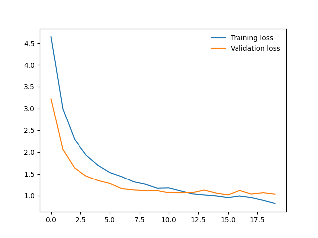
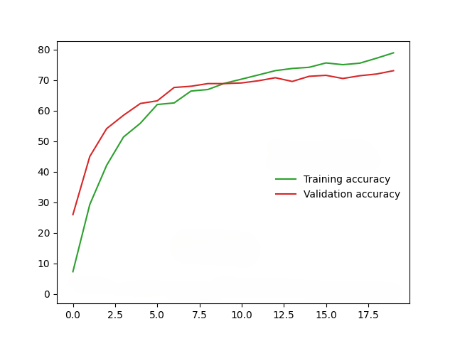

## Fine Tuning MobileNet-v2 for CUB-200-2011 Dataset
## Introduction
This repo contains codes for fine tuning MobileNet-v2 on CUB_200_2011 datasets. MobileNet-V2 was chosen for fine-tuning because of its light nature, ofcourse other pretrained models like ResNets, VGGs, etc. can fit the data better due to their high complexity.

The detailed report has been provided [here](./report.pdf). You can access the training logs in this [file](./training.log)
## Datasets
**CUB-200-2011**

CUB-200-2011 dataset has 11,788 images of 200 bird species. The dataset is available [here](https://data.caltech.edu/records/65de6-vp158/files/CUB_200_2011.tgz?download=1).

The structure of the dataset is as follows:
- Images are contained in the directory data/cub200/raw/images/, with 200 subdirectories.
- Format of images.txt: <image_id> <image_name>
- Format of train_test_split.txt: <image_id> <is_training_image>
- Format of classes.txt: <class_id> <class_name>
- Format of iamge_class_labels.txt: <image_id> <class_id>

## Directions To Training
Run "python3 combined.py --help" for help regarding input and hyperparameters tuning and then run "python3 combined.py _args_" with appropriate arguments.

## Directions to Testing Trained Model
Import the 'CUBModel' class from cubmodel.py file and do "model = CUBModel.load_model('./path/to/saved/model')" to load the model. 

You can use the 'predict_from_image_path' function to predict output with image address as input and the 'predict_from_image_array' function to predict output with image's numpy array as input

## Results
The loss graph while training:

The accuracy graph while training:

